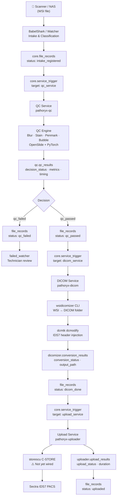
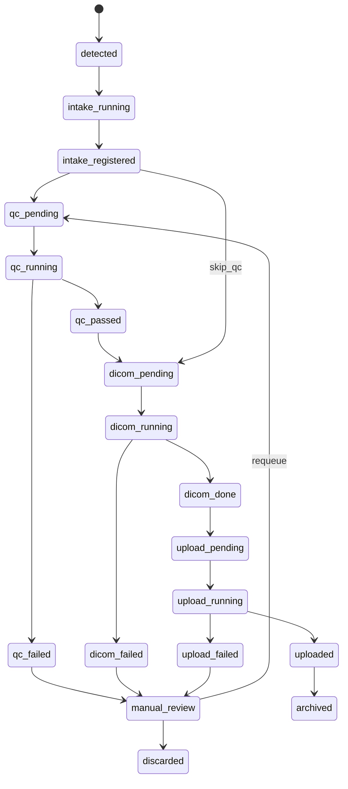
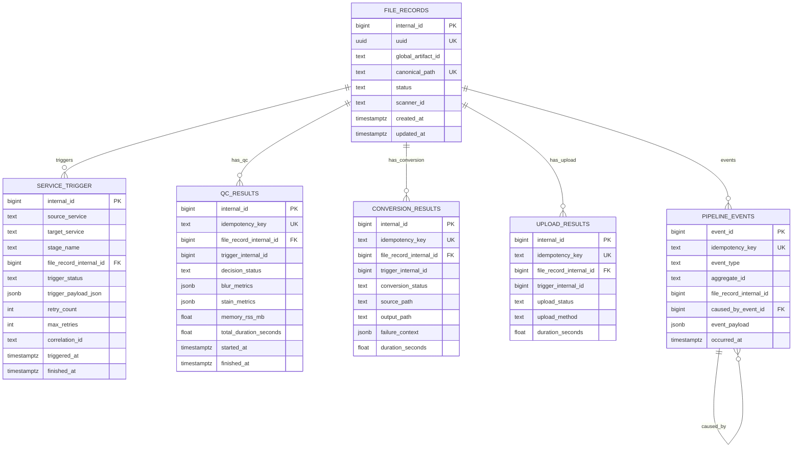
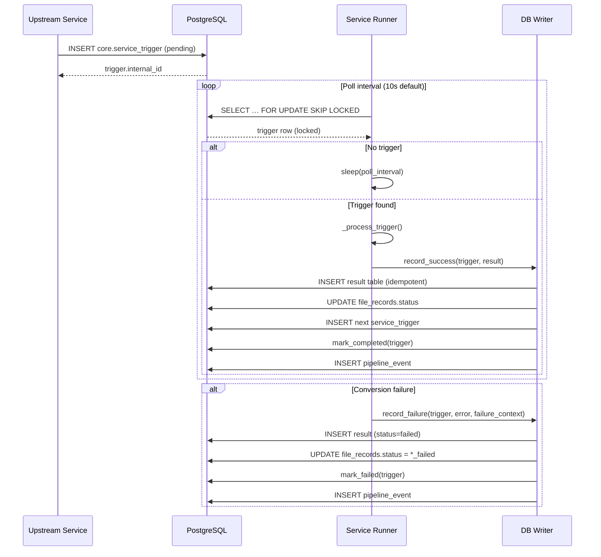
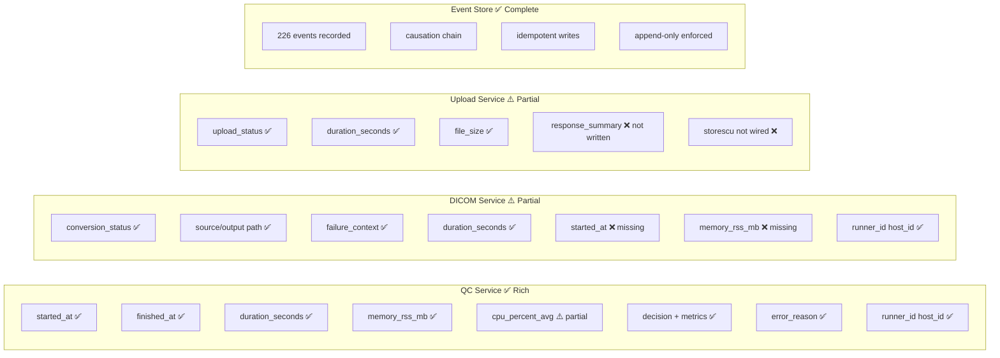

# Pathoryx Enterprise — Architecture Diagrams

## Diagram 1: Pipeline Flow

## Diagram 2: FileRecord State Machine

## Diagram 3: Entity Relationship (Core)

## Diagram 4: Trigger Lifecycle

## Diagram 5: Telemetry Coverage

